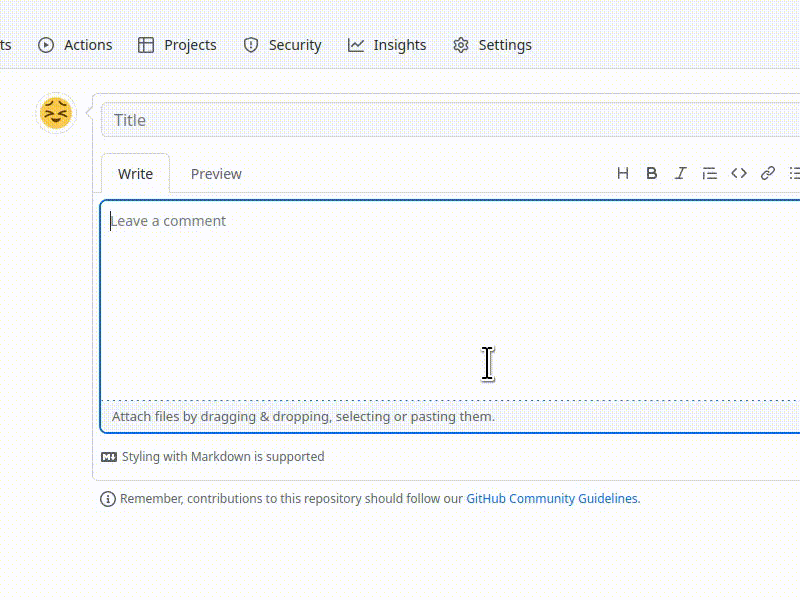
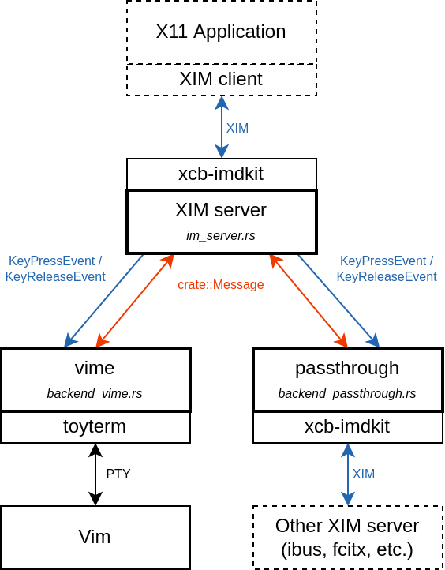

# vime

Using Vim as an [input method editor](https://en.wikipedia.org/wiki/Input_method) for X11 applications.

- Like other IMEs, you can use vime (almost) anywhere you need to input text.
- Unlike other IMEs, vime itself does not provide any text conversion to different languages.



In the above demo, I used [fcitx](https://github.com/fcitx/fcitx5) with vime to input Japanese sentences.

## Installation

1. Clone this repo recursively, and then apply patches to the dependencies:
```
$ git clone https://github.com/algon-320/vime.git --recursive
$ ./apply_patches.sh
```

2. Copy the configuration files:
```
$ mkdir -p ~/.config/vime
$ cp config_example/* ~/.config/vime
```

3. Install the terminfo for `toyterm`, which is a terminal emulator vime uses to run Vim:
```
$ tic -x -o ~/.terminfo/ toyterm/toyterm.info
```

4. (Optionally) Install vime:
```
$ cargo install --path ./vime
```

To uninstall vime, do the opposite:
```
$ cargo uninstall vime
$ rm -r ~/.config/vime
$ rm ~/.terminfo/t/toyterm.info
```

## Usage

1. Start a vime process:
```
$ cargo run --release
```
or if you installed vime:
```
$ vime
```

Note for those who are using another input method, you can use it with vime.
To do that, please make sure `$XMODIFIERS` is defined properly for the vime process.
For example to use `fcitx` with vime:
```
$ XMODIFIERS="@im=fcitx" vime
```

2. (Open another terminal and) set the following environment variables:
```
$ export XMODIFIERS="@im=vime" # for X11 apps
$ export GTK_IM_MODULE="xim"   # for GTK apps
$ export  QT_IM_MODULE="xim"   # for Qt apps
```

NOTE: vime might not work in Qt apps for now.
I am going to create a Qt plugin to work properly, but it is WIP yet.

3. Start your favorite application (e.g. Firefox).
4. Focus any input field (e.g. HTML form).
5. Hit <kbd>Alt</kbd>+<kbd>RightShift</kbd> key to trigger (toggle) vime.
6. Write some text and save it with `:wq` normally.
7. The text you've just written would be inserted in the input field.

## Customization

### vimrc
Since vime starts a Vim with `~/.config/vime/vimrc` by default,
you can customize vim behavior by editing it.

### different text editor
If your favorite text editor is runnable in a terminal, then you should be able to use it as input method.
To change the editor to use, set `VIME_EDITOR` environment variable for the vime process.
If the variable is not defined, vime will use `/usr/bin/vim -u ~/.config/vime/vimrc` instead.

The following example shows how to use Emacs as an input method:
```
$ VIME_EDITOR='/usr/bin/emacs -nw' vime
```

### trigger key
To change the key combination to trigger vime, edit `trigger_key_state` and `trigger_key_keycode` fields in `~/.config/vime/config.toml`.
- `trigger_key_state` is the state of modifier keys.
- `trigger_key_keycode` is the keycode of the key.
- Note that these values can differ for different physical keyboards.

You can use the `xev` utility to lookup the values of your favorite key combination.

### terminal appearance
You can also configure the terminal by editing `~/.config/vime/config.toml`.

See the [toyterm](https://github.com/algon-320/toyterm) repo for details about toyterm.


## License

- `patches/xcb-imdkit-rs.patch`, the patch file for [xcb-imdkit-rs](https://github.com/H-M-H/xcb-imdkit-rs), is licensed under LGPLv2.1
- `patches/winit.patch`, the patch file for [winit](https://github.com/rust-windowing/winit), is licensed under Apache-2.0
- the other parts are licensed under Apache-2.0

----

## Architecture



